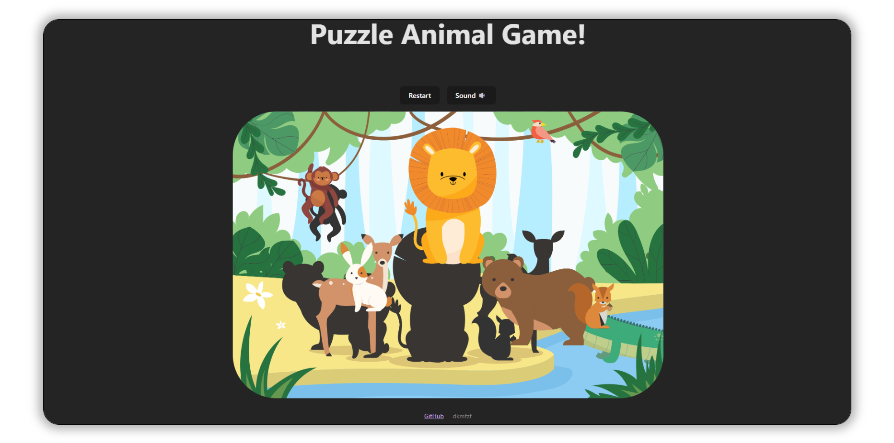
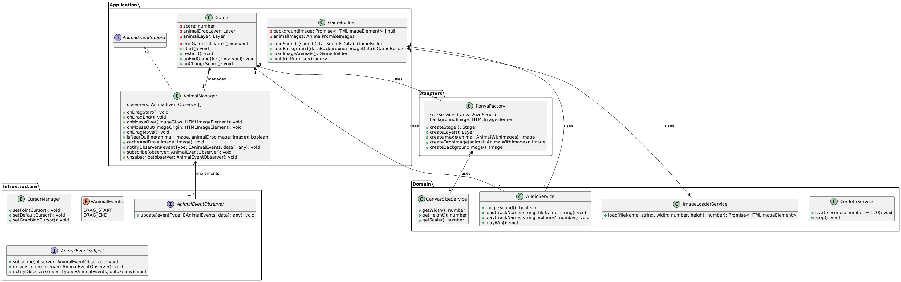

<h1 align="center">Puzzle Animal Game</h1>
<p align="center">
  <em>The pet project was inspired by an example from the Konva documentation, where a similar game was created, only in a functional programming style. In this project, everything was implemented through OOP with a Clean Architecture approach.</em>
</p>


[Дока на русском](./docs/README.ru.md)

## Project structure

- ```src/``` — project source files
- ```src/adapters``` — the application adapter layer
- ```src/application``` — the application layer
- ```src/domain``` — the domain layer
- ```src/infrastructure``` - the infrastructure layer
- ```src/types``` - project test files
- ```src/composition``` — launching the app

## Installation and launch

To install and run the project, run the following commands

**Cloning the slokaln repository project**
```Bash
git clone https://github.com/DKMFzF/puzzle-animal-game-CA.git
```

**Going to the project directory**
```Bash
cd puzzle-animal-game-CA
```

**Locking up third-party libraries**
```Bash
npm install
npm run start
```

or

```Bash
yarn
yarn start
```

## Assembly

```
npm run build
```

or

```
yarn build
```

## Application Architecture (Clean Architecture)
Clean Architecture is an approach to software design proposed by Robert Martin (Uncle Bob), which aims to create flexible, scalable, and easily maintainable systems. The basic idea is to divide the system into layers with clearly defined responsibilities and dependencies in order to minimize connectivity between components and ensure independence from external factors such as frameworks, databases or user interfaces.

A pure architecture organizes a system in the form of concentric layers, where the outer layers (for example, UI or database) depend on the inner ones (business logic), but not vice versa. This is achieved through the use of abstractions and Dependency Inversion Principle, which makes the system more resilient to change and simplifies its development.

#### The detailed diagram of the project is small


