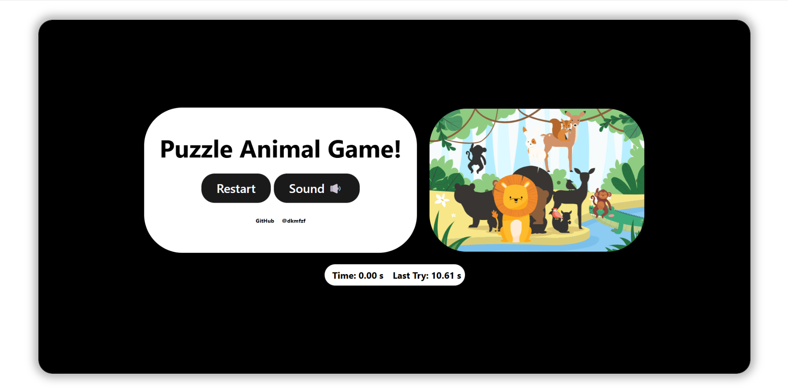
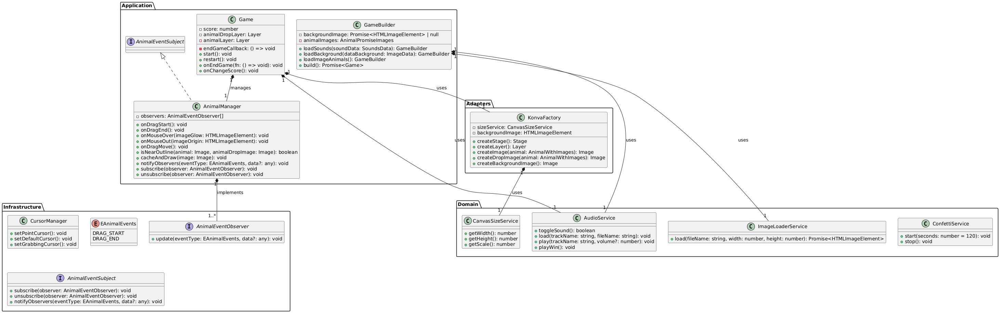

<h1 align="center">Игра-головоломка с животными</h1>
<p align="center">
 <em>Проект «Питомец» был вдохновлен примером из документации Konva, где была создана аналогичная игра, только в стиле функционального программирования. В этом проекте все было реализовано с помощью ООП и подхода «чистой архитектуры».</em>
</p>



## Структура проекта

- ```src/``` — исходные файлы проекта
- ```src/adapters``` — уровень адаптера приложения
- ```src/application``` — уровень приложения
- ```src/domain``` — уровень домена
- ```src/infrastructure``` — уровень инфраструктуры
- ```src/types``` — тестовые файлы проекта
- ```src/composition``` — запуск приложения

## Установка и запуск

Чтобы установить и запустить проект, выполните следующие команды

**Клонирование проекта из репозитория slokaln**
```Bash
git clone https://github.com/DKMFzF/puzzle-animal-game-CA.git
```

**Переход в каталог проекта**
```Bash
cd puzzle-animal-game-CA
```

**Установка сторонних библиотек**
```Bash
npm install
npm run start
```

или

```Bash
yarn
yarn start
```

## Сборка

```
npm run build
```

или

```
yarn build
```

## Архитектура приложения (чистая архитектура)
 Чистая архитектура — это подход к проектированию программного обеспечения, предложенный Робертом Мартином (дядей Бобом), который направлен на создание гибких, масштабируемых и легко поддерживаемых систем. Основная идея заключается в разделении системы на уровни с чётко определёнными обязанностями и зависимостями, чтобы свести к минимуму взаимодействие между компонентами и обеспечить независимость от внешних факторов, таких как фреймворки, базы данных или пользовательские интерфейсы. 

 Чистая архитектура представляет собой систему, состоящую из концентрических уровней, где внешние уровни (например, пользовательский интерфейс или база данных) зависят от внутренних (бизнес-логика), но не наоборот.  Это достигается за счёт использования абстракций и принципа инверсии зависимостей, что делает систему более устойчивой к изменениям и упрощает её разработку.

#### Подробная схема проекта небольшая

